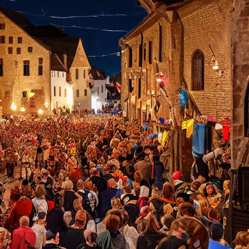

A friend of mine working in art/design wanted to try out [Stable Diffusion](https://stability.ai/blog/stable-diffusion-public-release) on his own GPU-equipped PC, but he doesn't know much about coding, so I thought that baking a quick docker build was an easy way to help him out. This repo holds the files that go into that build.

I also took the liberty of throwing in a simple web UI (made with gradio) to wrap the model. Perhaps we can evolve it a bit to offer a few more functionalities (see TODO).

**UPDATE:** we now support inference on multiple GPUs with a "Data Parallel" approach (see `Installation` section).

# Requirements
 - OS: Ubuntu (tested on 20.04) or Windows (tested on Windows 10 21H2)
 - Nvidia GPU with at least 6GB vRAM (gtx 700 onward, please refer [here](https://docs.nvidia.com/deeplearning/cudnn/support-matrix/index.html)). Mind that the bigger the image size (or the number of images) you want to dream, the more memory you're gonna need. For reference, dreaming a 256x256 image should take up ~5gb, while a 512x512 around 7gb. 
 - Free Disk space > 2.8gb
 - Docker and Nvidia-docker.
 - HuggingFace account as well as registration to this repository https://huggingface.co/CompVis/stable-diffusion-v1-4 (simply click on `Access Repository`).

# Installation

First of all, make sure to have docker and nvidia-docker installed in your machine.

**Windows users**: [install WSL/Ubuntu](https://stackoverflow.com/a/56783810) from store->install [docker](https://docs.docker.com/desktop/windows/wsl/) and start it->update Windows 10 to version 21H2 (Windows 11 should be ok as is)->test out [GPU-support](https://docs.nvidia.com/cuda/wsl-user-guide/index.html#cuda-support-for-wsl2) (a simple `nvidia-smi` in WSL should do). If `nvidia-smi` does not work from WSL, make sure you have updated your nvidia drivers from the official app. 

The easiest way to try out the model is to simply use the pre-built image at `nicklucche/stable-diffusion`.   
Note that you will need a huggingface token, you can get yours at https://huggingface.co/settings/tokens after registering for free on their website.

My advice is that you start the container with:

`docker run --name stable-diffusion --gpus all -it -e TOKEN=<YOUR_TOKEN> -p 7860:7860 nicklucche/stable-diffusion` 

the *first time* you run it, as it will download the model weights (can take a few minutes to do so) and store them on disk (as long as you don't delete the container).
Then you can simply do `docker stop stable-diffusion` to stop the container and `docker start stable-diffusion` to bring it back up whenever you need.

Once the init phase is finished a message will pop-up in your terminal (`docker logs stable-diffusion`) and you should be able to head to http://localhost:7860/ in your favorite browser and see something like this:

By default, the half-precision/fp16 model is loaded. This is the recommended approach if you're planning to run the model on a GPU with < 10GB of memory. To disable FP16 and run inference using single-precision set the environment variable FP16=0 as a docker run option, like so:

`docker run .. -e FP16=0 ...`  

### Multi-GPU

The model can be run in a "DataParallel" fashion, meaning that it is replicated over multiple GPUs, each handled by a separate sub-process. By default, the model runs on device 0. You can change that by specifying the desired device(s) by adding one of the following options:

 - `-e DEVICES=1 ...` runs model on GPU 1 (starts from 0)
 - `-e DEVICES=0,1 ...` runs model on GPU 0 and 1
 - `-e DEVICES=all ...` runs model on all available GPUs

Each device generates a full image, so make sure you increase the `Number of Images` slider to generate multiple images in parallel!
(Single image generation speed won't be affected).

I should also mention that adding the nsfw filter (by checking corresponding box) includes moving an additional model to GPU, so it can cause out of memory issues.

**P.S:** Feel free to open an issue for any problem you may face during installation.

# Samples

The internet is full of these, but I felt I couldn't put up this repo without sharing a few of "my own".. 

## TODO
 - [ ] allow other input modalities (images)
 - [x] move model to specifiec GPU number (env variable)
 - [x] multi-gpu support (data parallel)
 - [ ] multi-gpu support (PipelineParallel/model parallel)
 - [ ] dump and clear prompt history
 - [ ] test on older cudnn
